# ShipViewer 软件测试报告


使用说明：

1. 本模板面向 Typora 编写，并用于最终导出 PDF。
2. 红色文字表示仍需你手动补充、确认或删除的内容。
3. 所有 HTML 注释（即 <!-- ... -->）仅用于编辑提示，导出 PDF 时通常不会显示。
4. 建议测试截图统一保存在 plans/test-images/ 目录下，并按章节建立子目录。
5. 若截图尚未准备，可先保留图片占位，后续直接替换同名文件。

> 文档用途：记录 ShipViewer 当前版本的手工功能测试过程、测试结果、截图证据和问题结论。

---

## 1. 文档基本信息

| 项目 | 内容 |
| --- | --- |
| 文档名称 | ShipViewer 软件测试报告 |
| 项目名称 | ShipViewer |
| 软件版本 | v1.0 |
| 测试阶段 | 功能测试 |
| 编写人 | 方天纬 |
| 测试执行人 | 方天纬 |
| 编写日期 | 2026-05-25 |
| 文档版本 | V1.0 |

<!--
建议在本章下方插入一张程序主界面总览图，作为“被测系统外观参考图”。
推荐图片路径：./test-images/01-overview/01_main-window-overview.png
推荐说明：用于说明本次测试所基于的程序界面版本和主要区域布局。
-->

### 1.1 程序主界面总览

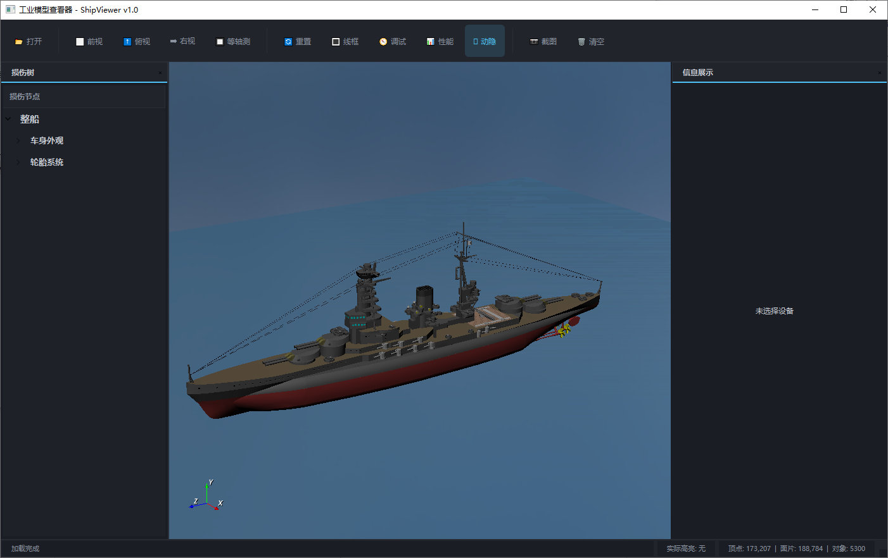

**图 1-1 程序主界面总览**  
说明：请替换为程序启动后、模型已正常显示时的完整界面截图。建议保留顶部工具栏、左侧损伤树、中间三维视口、右侧信息展示区和底部状态栏。

---

## 2. 修订记录

| 版本号 | 日期 | 修订人 | 修订说明 |
| --- | --- | --- | --- |
| V1.0 | 2026-05-25 | 初版建立（模板已预填基础环境与版本信息） |无|
| V1.1 |  |  |  |
| V1.2 |  |  |  |

---

## 3. 测试目的与范围

### 3.1 测试目的

本次测试的目标是验证 ShipViewer 在当前版本下的主要功能是否满足预期，包括模型加载、视图切换、损伤树联动、设备信息展示、截图保存以及调试/性能相关显示功能，并为后续问题修复和版本验收提供依据。

### 3.2 测试范围

本次测试覆盖以下内容：

- 模型文件打开与加载结果
- 三维视口显示效果
- 视图切换与相机控制
- 线框模式、水面显示等视图选项
- 损伤树节点展示与交互联动
- 右侧信息展示区域内容呈现
- 鼠标悬停简介提示
- 截图保存功能
- 调试与性能信息显示
- 清空场景后的界面恢复情况

### 3.3 不在本次范围内

以下内容不纳入本报告：

- 自动化测试脚本验证
- 单元测试与源码级覆盖率分析
- 安装包发布流程测试
- 多操作系统兼容性专项测试
- 长时间稳定性与压力测试（如未执行）

---

## 4. 测试环境

| 环境项 | 内容 |
| --- | --- |
| 操作系统 | Windows 10 64位（10.0.19045） |
| 程序运行方式 | 直接运行 EXE 可执行程序 |
| 显卡/显示环境 | NVIDIA GeForce RTX 5080（系统同时检测到虚拟显示适配器：GameViewer / Parsec） |
| 屏幕分辨率 | 2560 × 1440 |
| 主机名 | DESKTOP-DK593DU |
| CPU | Intel(R) Core(TM) i5-14600KF |
| 内存 | 31.79 GB |
| 测试模型文件 | `assets/model/IJNnagato.3dm` |
| 测试数据文件 | `assets/csv/damage-tree-nodes.csv`、`assets/json/device-catalog.json`、`assets/json/abstract.json` |
| 测试日期 | 2026-05-22 |

<!--
如果你的环境配置比较关键，例如不同显卡会影响渲染效果，可在这里补一张“环境信息”截图，
也可以不放图，仅保留文字表格。
-->

---

## 5. 被测功能概览

| 编号 | 功能模块 | 入口位置 | 预期行为简述 | 是否测试 |
| --- | --- | --- | --- | --- |
| F-01 | 模型加载 | 顶部“打开”按钮 / 文件菜单 | 可成功打开并显示模型 | 是 |
| F-02 | 视图切换 | 前视 / 俯视 / 右视 / 等轴测 | 相机视角正确切换 | 是 |
| F-03 | 相机重置 | “重置”按钮 | 视角回到默认观察状态 | 是 |
| F-04 | 线框模式 | “线框”按钮 | 模型显示切换为线框/实体 | 是 |
| F-05 | 水面显示 | “显示水面”选项 | 水面可显示/隐藏 | 是 |
| F-06 | 损伤树交互 | 左侧损伤树 | 节点展开、点击、联动正常 | 是 |
| F-07 | 信息展示 | 右侧信息面板 | 显示设备属性与图片 | 是 |
| F-08 | 悬停简介 | 鼠标悬停模型 | 弹出简介提示 | 是 |
| F-09 | 截图保存 | 顶部“截图”按钮 / 文件菜单 | 成功保存当前视图截图 | 是 |
| F-10 | 调试显示 | 顶部“调试”按钮 | 调试信息可显示/关闭 | 是 |
| F-11 | 性能显示 | 顶部“性能”按钮 | 性能覆盖信息可显示/关闭 | 是 |
| F-12 | 清空场景 | 顶部“清空”按钮 | 场景被清空且状态重置 | 是 |

---

## 6. 测试方法与判定准则

### 6.1 测试方法

本次测试以手工功能测试为主，测试人员通过界面操作验证功能行为，并结合截图记录实际结果。对关键交互步骤保留操作证据，对异常现象单独记录问题条目。

### 6.2 判定准则

满足以下条件时，可判定测试项通过：

- 实际结果与预期结果一致；
- 界面无明显错位、闪烁、缺失或错误提示；
- 无崩溃、卡死、无响应现象；
- 截图、信息展示、模型联动等关键功能可正常完成；
- 若存在轻微问题，不影响主要目标时，可在备注中说明并视情况判定为“基本通过”或“有条件通过”。

### 6.3 结论标记建议

建议统一使用以下填写方式：

- **通过**：功能与预期一致
- **失败**：功能与预期不一致
- **阻塞**：因环境、数据或前置问题无法继续验证
- **待确认**：现象存在但尚需进一步分析

---

## 7. 测试用例总表

<!--
这一章用于做“总索引”，不要在这里放太长的过程描述。
证据编号建议与截图文件一一对应，例如：EV-02-01、EV-04-03。
-->

| 用例编号 | 功能模块 | 测试项名称 | 前置条件 | 预期结果 | 实际结果 | 结论 | 证据编号 |
| --- | --- | --- | --- | --- | --- | --- | --- |
| TC-01 | 模型加载 | 打开模型文件 | 程序已启动 | 模型正常显示 | 模型正常显示 | 通过 |EV-01-01|
| TC-02 | 视图切换 | 切换到前视图 | 模型已加载 | 视角切换正确 | 视角切换正确                                            | 通过 | EV-02-01 |
| TC-03 | 视图切换 | 切换到俯视图 | 模型已加载 | 视角切换正确 | <span style="color:red; font-weight:600;">待填写</span> | <span style="color:red; font-weight:600;">待填写</span> | EV-02-02 |
| TC-04 | 视图切换 | 切换到右视图 | 模型已加载 | 视角切换正确 | <span style="color:red; font-weight:600;">待填写</span> | <span style="color:red; font-weight:600;">待填写</span> | EV-02-03 |
| TC-05 | 视图切换 | 切换到等轴测视图 | 模型已加载 | 视角切换正确 | <span style="color:red; font-weight:600;">待填写</span> | <span style="color:red; font-weight:600;">待填写</span> | EV-02-04 |
| TC-06 | 显示模式 | 切换线框模式 | 模型已加载 | 线框显示正常 | <span style="color:red; font-weight:600;">待填写</span> | <span style="color:red; font-weight:600;">待填写</span> | EV-03-01 |
| TC-07 | 损伤树交互 | 点击损伤节点联动模型 | 损伤树已加载 | 正确高亮对应部位 | <span style="color:red; font-weight:600;">待填写</span> | <span style="color:red; font-weight:600;">待填写</span> | EV-04-02 |
| TC-08 | 信息展示 | 点击模型显示设备信息 | 存在设备映射数据 | 右侧信息展示正确 | <span style="color:red; font-weight:600;">待填写</span> | <span style="color:red; font-weight:600;">待填写</span> | EV-05-01 |
| TC-09 | 截图保存 | 保存当前视口截图 | 模型已加载 | 图片成功保存 | <span style="color:red; font-weight:600;">待填写</span> | <span style="color:red; font-weight:600;">待填写</span> | EV-06-01 |
| TC-10 | 清空场景 | 清空当前模型 | 模型已加载 | 场景与状态被重置 | <span style="color:red; font-weight:600;">待填写</span> | <span style="color:red; font-weight:600;">待填写</span> | EV-07-03 |

---

## 8. 分模块测试记录

<!--
本章是整份测试报告的核心内容。
建议每个测试项都保留：前置条件、步骤、预期结果、实际结果、结论、截图证据。
如果某一章截图很多，可以按“总览图 + 关键步骤图 + 结果图”的顺序放置。
-->

### 8.1 模型加载测试

#### 8.1.1 测试项：打开模型文件

| 项目 | 内容 |
| --- | --- |
| 用例编号 | TC-01 |
| 功能模块 | 模型加载 |
| 前置条件 | 程序已启动，待测试模型文件存在 |
| 测试数据 | `assets/model/IJNnagato.3dm` |
| 预期结果 | 选择模型后程序成功加载，主视口显示模型，状态栏有相应反馈 |
| 实际结果 | 选择模型后程序成功加载，主视口显示模型，状态栏有相应反馈 |
| 测试结论 |
| 证据编号 | EV-01-01 |

**操作步骤：**

1. 启动程序。
2. 点击顶部“打开”按钮，或使用文件菜单打开模型。
3. 选择指定模型文件。
4. 观察加载过程、视口显示结果及状态栏信息。

**结果说明：**  
成功显示舰船模型、存在一定加载卡顿、未出现错误提示。

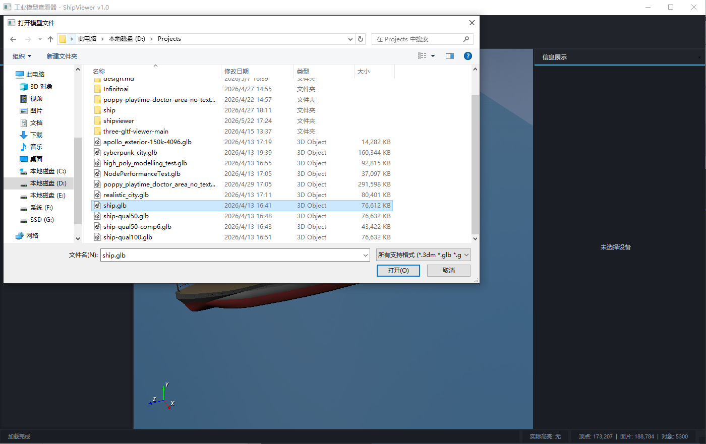

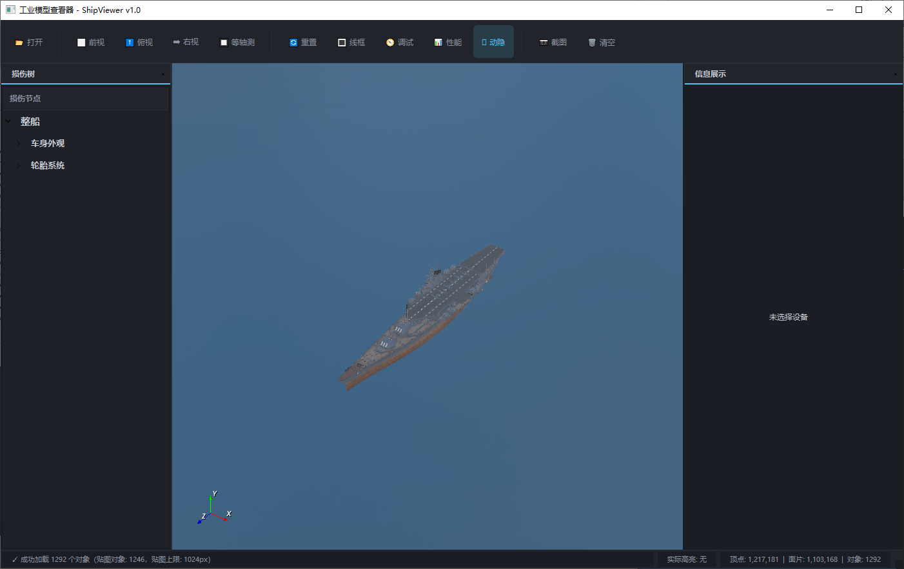

**图 8-1 模型加载结果**  
说明：请替换为模型成功加载后的完整界面截图，建议保留状态栏“加载完成”或类似状态信息。

---

### 8.2 视图与视角控制测试

#### 8.2.1 测试项：前视图切换

| 项目 | 内容 |
| --- | --- |
| 用例编号 | TC-02 |
| 功能模块 | 视图切换 |
| 前置条件 | 模型已加载 |
| 预期结果 | 切换到前视图后，模型朝向符合预期 |
| 实际结果 | 切换到前视图后，模型朝向符合预期 |
| 测试结论 |通过|
| 证据编号 | EV-02-01 |

**操作步骤：**

1. 在模型已加载状态下点击“前视”。
2. 观察模型在主视口中的朝向变化。
3. 对比默认视角与前视图是否符合设计预期。

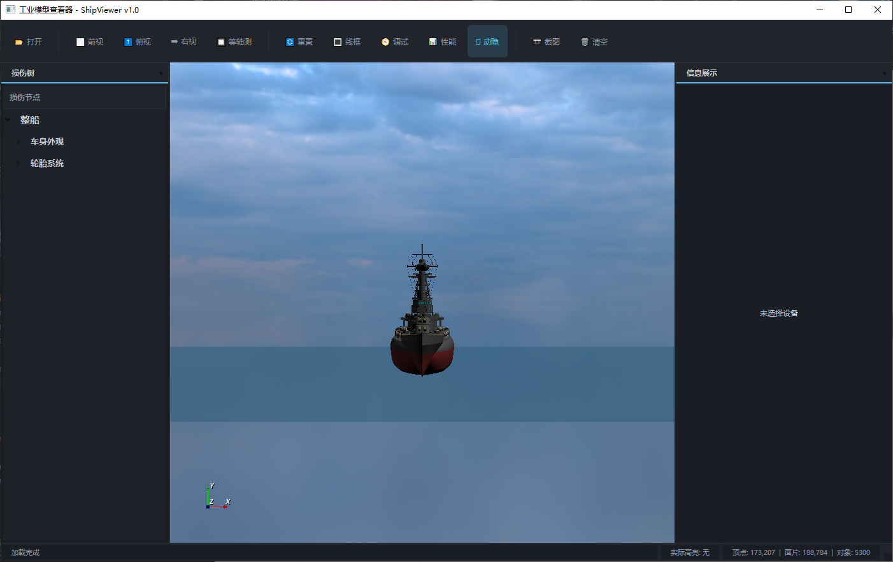

**图 8-2 前视图效果**  

#### 8.2.2 测试项：俯视图切换

| 项目 | 内容 |
| --- | --- |
| 用例编号 | TC-03 |
| 功能模块 | 视图切换 |
| 前置条件 | 模型已加载 |
| 预期结果 | 切换到俯视图后，模型朝向符合预期 |
| 实际结果 | 切换到俯视图后，模型朝向符合预期 |
| 测试结论 | 通过 |
| 证据编号 | EV-02-02 |

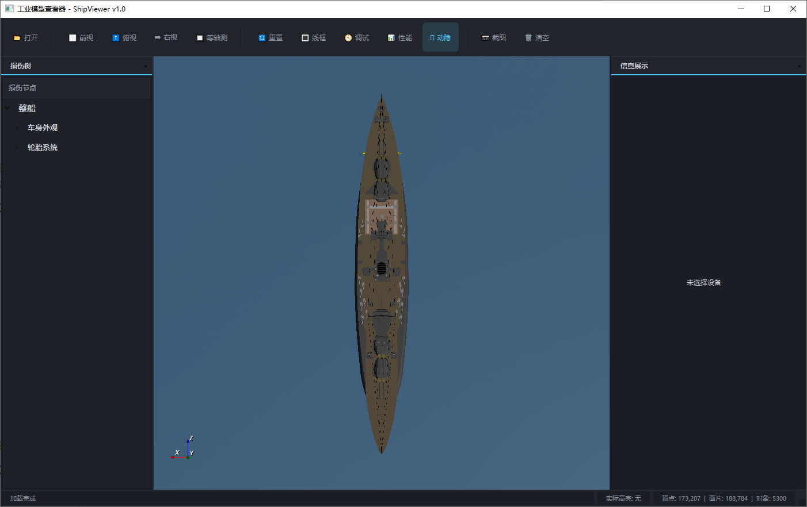

**图 8-3 俯视图效果**  

#### 8.2.3 测试项：右视图切换

| 项目 | 内容 |
| --- | --- |
| 用例编号 | TC-04 |
| 功能模块 | 视图切换 |
| 前置条件 | 模型已加载 |
| 预期结果 | 切换到右视图后，模型朝向符合预期 |
| 实际结果 | 切换到右视图后，模型朝向符合预期 |
| 测试结论 | 通过 |
| 证据编号 | EV-02-03 |

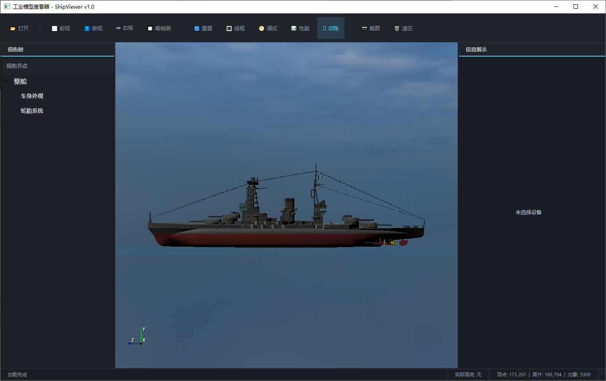

**图 8-4 右视图效果**

#### 8.2.4 测试项：等轴测视图切换

| 项目 | 内容 |
| --- | --- |
| 用例编号 | TC-05 |
| 功能模块 | 视图切换 |
| 前置条件 | 模型已加载 |
| 预期结果 | 切换到等轴测视图后，模型显示完整且角度合理 |
| 实际结果 | 切换到等轴测视图后，模型显示完整且角度合理 |
| 测试结论 | 通过 |
| 证据编号 | EV-02-04 |

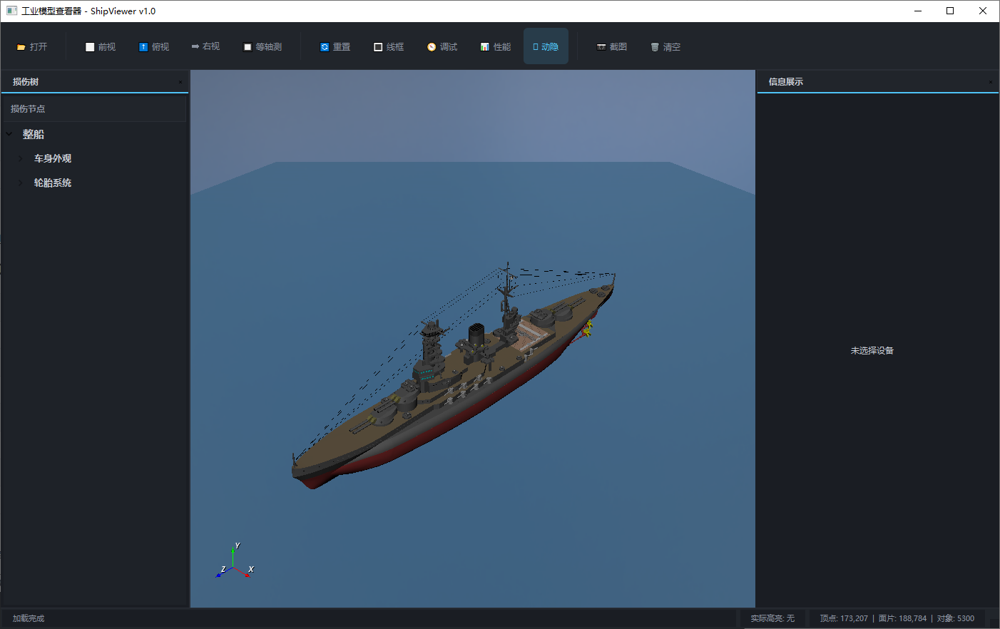

**图 8-5 等轴测视图效果**

#### 8.2.5 测试项：鼠标旋转、缩放与平移

| 项目 | 内容 |
| --- | --- |
| 用例编号 | TC-05-1 |
| 功能模块 | 视角控制 |
| 前置条件 | 模型已加载 |
| 预期结果 | 鼠标操作后视角响应正确，无明显卡顿或失控 |
| 实际结果 | 鼠标操作后视角响应正确，无明显卡顿或失控 |
| 测试结论 | 通过 |
| 证据编号 | EV-02-05 |

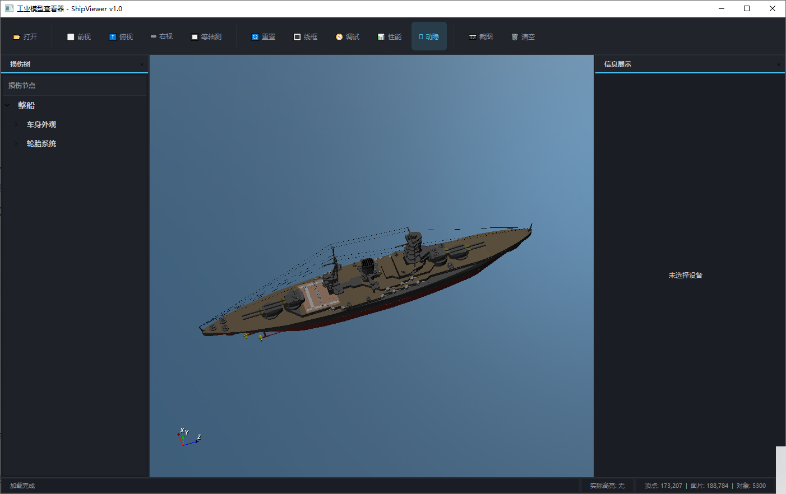

**图 8-6 视角控制结果**

---

### 8.3 显示模式测试

#### 8.3.1 测试项：线框模式切换

| 项目 | 内容 |
| --- | --- |
| 用例编号 | TC-06 |
| 功能模块 | 显示模式 |
| 前置条件 | 模型已加载 |
| 预期结果 | 开启线框模式后模型按线框显示，再次切换可恢复 |
| 实际结果 | 开启线框模式后，部分模型按线框显示，再次切换可恢复 |
| 测试结论 | 待确认 |
| 证据编号 | EV-03-01 |

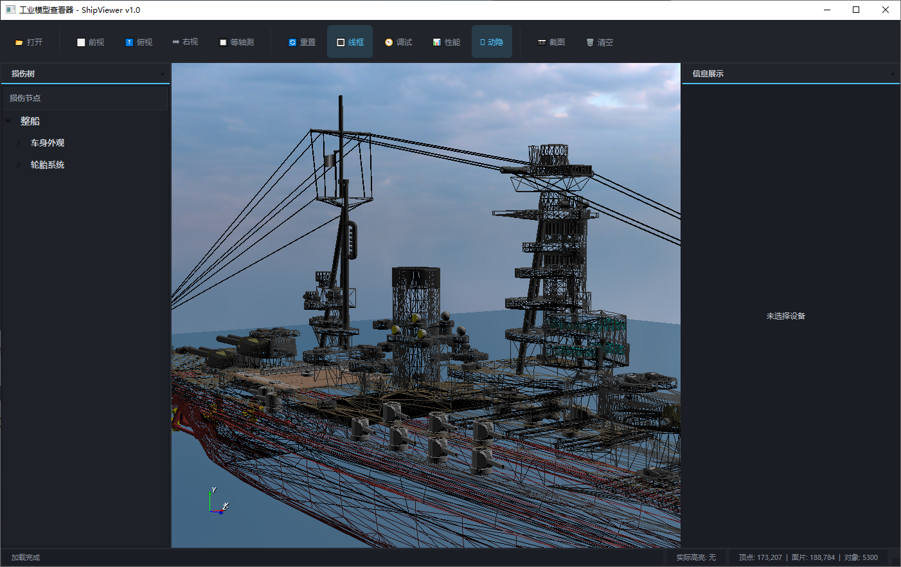

**图 8-7 线框模式显示效果**

#### 8.3.2 测试项：水面显示开关

| 项目 | 内容 |
| --- | --- |
| 用例编号 | <span style="color:red; font-weight:600;">请填写</span> |
| 功能模块 | 显示模式 |
| 前置条件 | 模型已加载 |
| 预期结果 | 水面显示状态可切换，切换后场景渲染结果正确 |
| 实际结果 | <span style="color:red; font-weight:600;">待填写</span> |
| 测试结论 | <span style="color:red; font-weight:600;">待填写</span> |
| 证据编号 | EV-03-02 |


**图 8-8 水面显示效果**

---

### 8.4 损伤树交互测试

#### 8.4.1 测试项：损伤树节点展示

| 项目 | 内容 |
| --- | --- |
| 用例编号 | TC-07 |
| 功能模块 | 损伤树 |
| 前置条件 | 程序已启动，损伤树数据已加载 |
| 预期结果 | 左侧树结构显示完整，层级清晰，可展开/收起 |
| 实际结果 | 左侧树结构显示完整，层级清晰，可展开/收起 |
| 测试结论 | 通过 |
| 证据编号 | EV-04-01 |

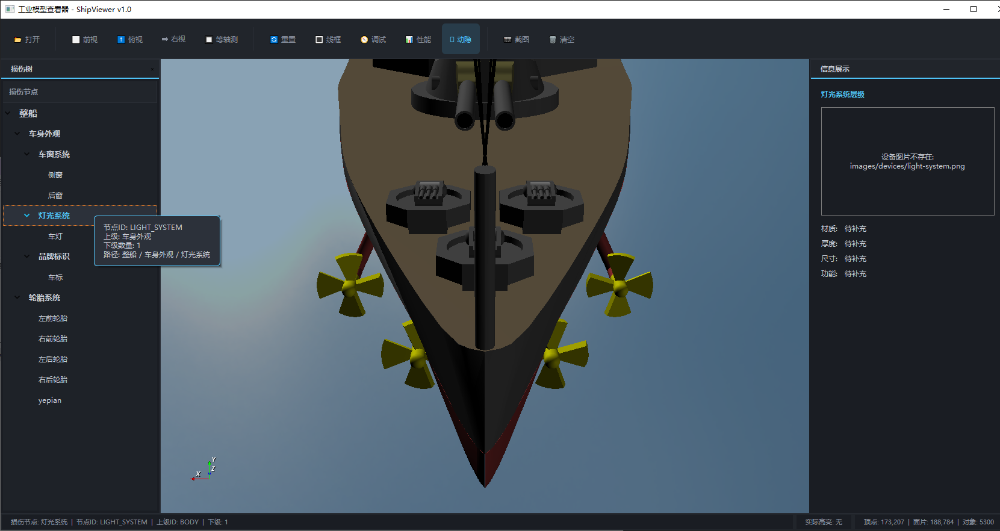

**图 8-9 损伤树总览**  

#### 8.4.2 测试项：点击节点联动模型高亮

| 项目 | 内容 |
| --- | --- |
| 用例编号 | TC-07-1 |
| 功能模块 | 损伤树联动 |
| 前置条件 | 模型已加载，损伤树节点可点击 |
| 预期结果 | 点击指定节点后，对应模型部位被正确定位或高亮 |
| 实际结果 | 点击指定节点后，对应模型部位被正确定位或高亮 |
| 测试结论 | 通过 |
| 证据编号 | EV-04-02 |

**操作步骤：**

1. 在左侧损伤树中展开目标节点。
2. 点击某个具体部位节点。
3. 观察中间主视口中对应模型部件是否被高亮、聚焦或联动显示。

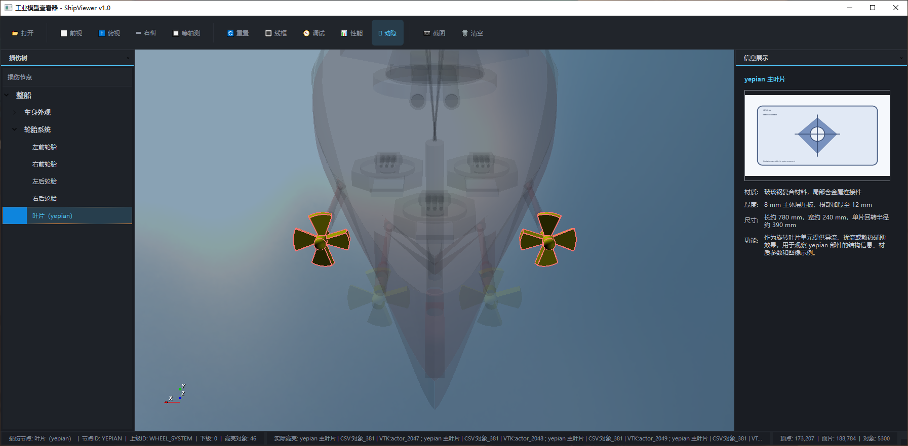

**图 8-10 损伤树节点联动效果**  

---

### 8.5 信息展示面板测试

#### 8.5.1 测试项：点击模型后显示设备信息

| 项目 | 内容 |
| --- | --- |
| 用例编号 | TC-08 |
| 功能模块 | 信息展示 |
| 前置条件 | 已加载模型，且目标模型存在设备映射数据 |
| 预期结果 | 右侧面板可显示名称、图片、材质、厚度、尺寸、功能等信息 |
| 实际结果 | <span style="color:red; font-weight:600;">待填写</span> |
| 测试结论 | <span style="color:red; font-weight:600;">待填写</span> |
| 证据编号 | EV-05-01 |


**图 8-11 设备信息展示效果**  

#### 8.5.2 测试项：未配置图片时的降级表现

| 项目 | 内容 |
| --- | --- |
| 用例编号 | TC-08-1 |
| 功能模块 | 信息展示 |
| 前置条件 | 测试数据中存在图片路径缺失或图片文件不存在的设备 |
| 预期结果 | 程序不崩溃，并显示默认提示或占位信息 |
| 实际结果 | 程序不崩溃，并显示默认提示 |
| 测试结论 |
| 证据编号 | EV-05-02 |

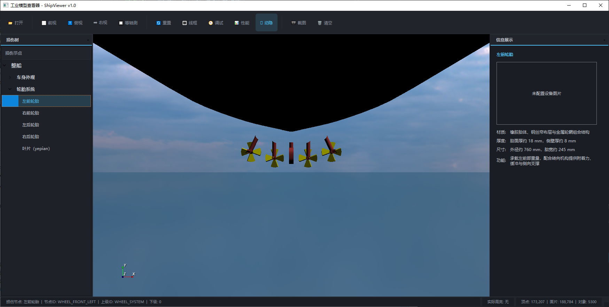

**图 8-12 图片缺失时的界面表现**

#### 8.5.2 测试项：图片缺失时的降级表现

| 项目     | 内容                                             |
| -------- | ------------------------------------------------ |
| 用例编号 | TC-08-2                                          |
| 功能模块 | 信息展示                                         |
| 前置条件 | 测试数据中存在图片路径缺失或图片文件不存在的设备 |
| 预期结果 | 程序不崩溃，并显示默认提示或占位信息             |
| 实际结果 | 程序不崩溃，并显示占位信息                       |
| 测试结论 | 通过                                             |
| 证据编号 | EV-05-03                                         |

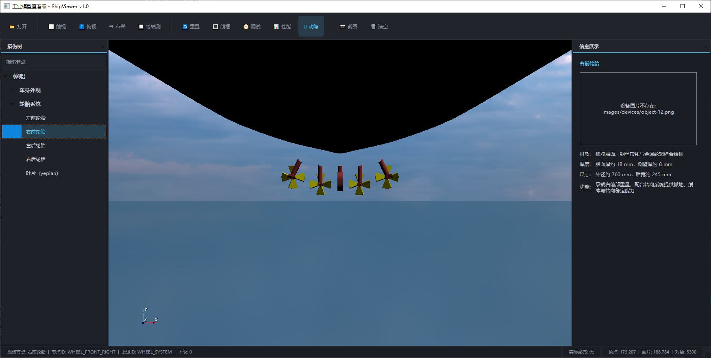

**图 8-13 图片缺失时的界面表现**

---

### 8.6 悬停简介测试

#### 8.6.1 测试项：悬停时显示简介提示

| 项目 | 内容 |
| --- | --- |
| 用例编号 | TC-08-3 |
| 功能模块 | 悬停简介 |
| 前置条件 | 模型存在简介数据，且目标对象可被悬停识别 |
| 预期结果 | 鼠标悬停时弹出简介提示，内容与对象匹配 |
| 实际结果 | 鼠标悬停时弹出简介提示，内容与对象匹配 |
| 测试结论 | 通过 |
| 证据编号 | EV-05-04 |

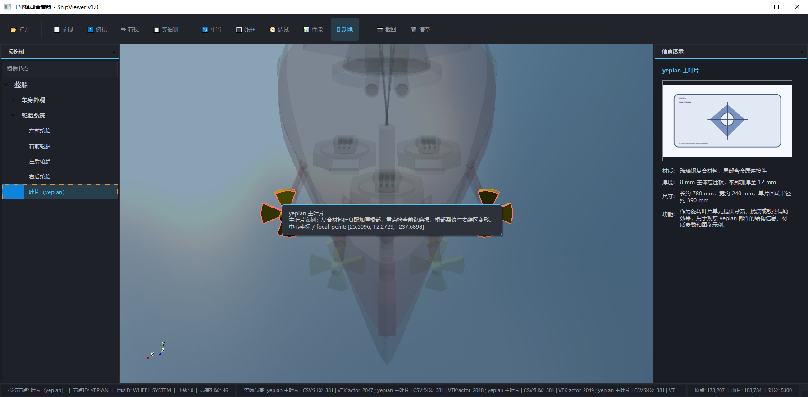

**图 8-14 悬停简介提示效果**  

---

### 8.7 截图保存测试

#### 8.7.1 测试项：保存当前视口截图

| 项目 | 内容 |
| --- | --- |
| 用例编号 | TC-09 |
| 功能模块 | 截图保存 |
| 前置条件 | 模型已加载且视口显示正常 |
| 预期结果 | 执行截图后文件成功保存，且内容与当前视图一致 |
| 实际结果 | 执行截图后文件成功保存，且内容与当前视图一致 |
| 测试结论 | 通过 |
| 证据编号 | EV-06-01 |

**操作步骤：**

1. 调整到需要保存的视角。
2. 点击“截图”按钮。
3. 选择保存路径并确认保存。
4. 打开输出图片检查结果。

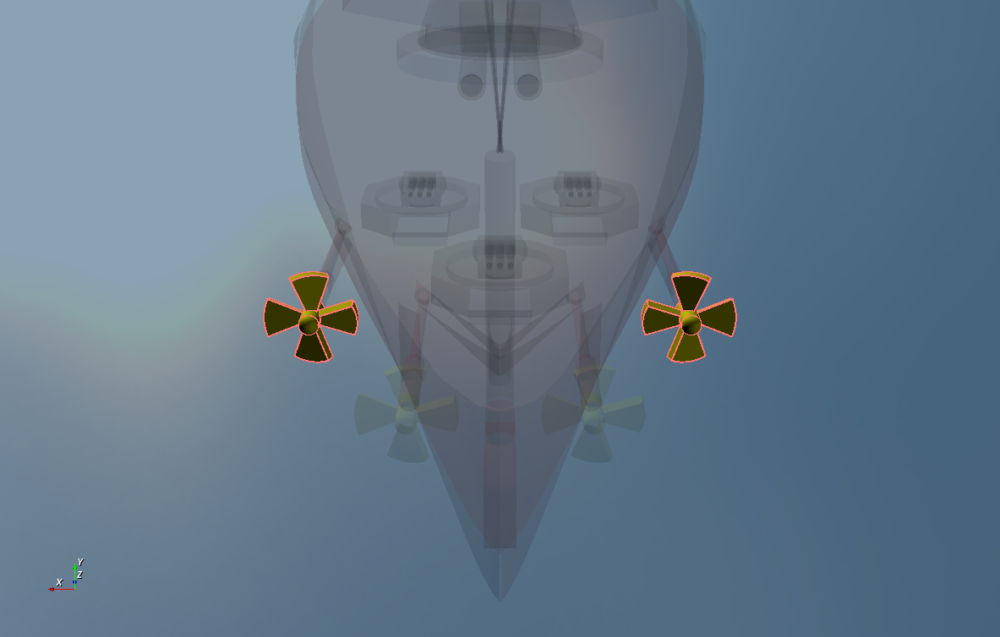

**图 8-15 截图保存操作结果**

---

### 8.8 调试与性能显示测试

#### 8.8.1 测试项：调试信息显示

| 项目 | 内容 |
| --- | --- |
| 用例编号 | TC-09-1 |
| 功能模块 | 调试显示 |
| 前置条件 | 模型已加载 |
| 预期结果 | 打开调试功能后，界面出现对应调试信息或调试框 |
| 实际结果 | 打开调试功能后，界面出现物体和摄像头空间坐标信息 |
| 测试结论 | 通过                                             |
| 证据编号 | EV-07-01 |

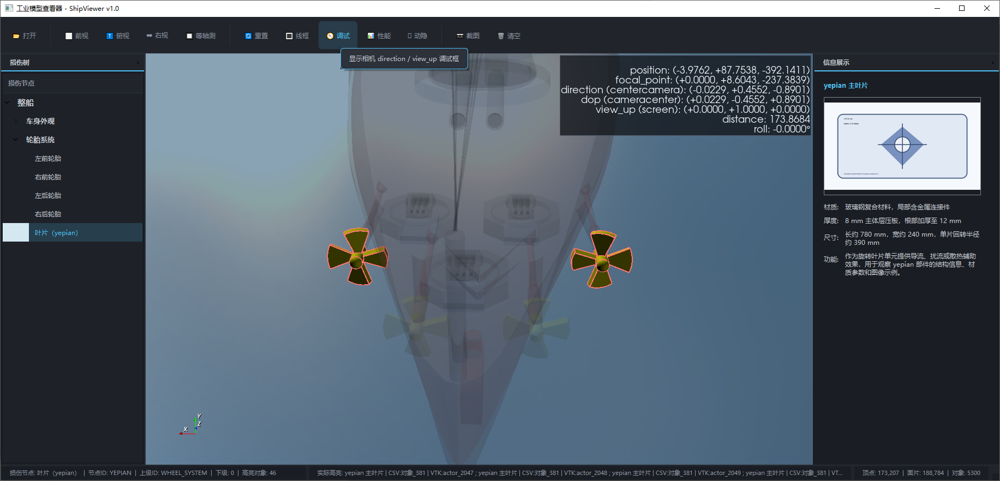

**图 8-16 调试显示效果**

#### 8.8.2 测试项：性能信息显示

| 项目 | 内容 |
| --- | --- |
| 用例编号 | TC-09-2 |
| 功能模块 | 性能显示 |
| 前置条件 | 模型已加载 |
| 预期结果 | 打开性能功能后，界面出现 FPS、渲染统计或类似性能信息 |
| 实际结果 | 打开性能功能后，界面出现 FPS、渲染统计等信息 |
| 测试结论 | 通过 |
| 证据编号 | EV-07-02 |

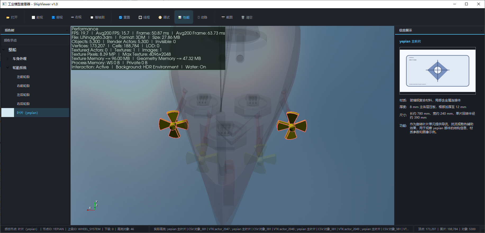

**图 8-17 性能显示效果**

---

### 8.9 清空场景测试

#### 8.9.1 测试项：清空当前场景

| 项目 | 内容 |
| --- | --- |
| 用例编号 | TC-10 |
| 功能模块 | 清空场景 |
| 前置条件 | 模型已加载，界面中已有当前模型显示 |
| 预期结果 | 执行清空后视口内容被清除，相关状态同步恢复 |
| 实际结果 | 执行清空后视口内容被清除 |
| 测试结论 | 通过 |
| 证据编号 | EV-07-03 |

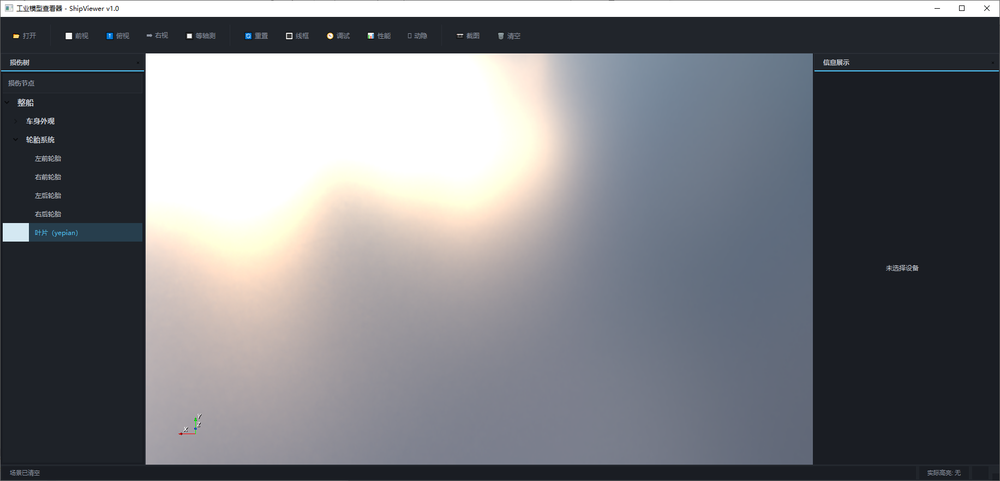

**图 8-18 清空场景后的界面效果**

---

## 9. 问题记录

| 问题编号 | 所属模块 | 问题标题 | 复现步骤 | 实际现象 | 预期现象 | 严重程度 | 状态 | 证据编号 |
| --- | --- | --- | --- | --- | --- | --- | --- | --- |
| BUG-001 | 显示模式 | 线框展示缺失 | 开启线框模式 | 部分模型按照线框展示 | 所有模型按照线框展示 | 一般 | 待处理 | EV-03-01 |
| BUG-002 |  |  |  |  |  |  |  |  |

### 9.1 问题截图示例


**图 9-1 问题现象示例图**  

---

## 10. 测试结论

### 10.1 总体结论

当前版本 ShipViewer 已完成主要功能验证，模型加载、视图切换、损伤树联动、信息展示与截图保存功能基本符合预期。测试过程中发现若干一般性问题，暂未发现导致程序无法使用的严重缺陷。综合判断，该版本可进入下一轮问题修复与回归测试。

### 10.2 结果汇总

| 统计项 | 数量 |
| --- | --- |
| 用例总数 | 18 |
| 通过数 | 17 |
| 失败数 | 0 |
| 阻塞数 | 0 |
| 待确认数 | 1 |
| 问题总数 | 1 |

### 10.3 发布建议

未发现严重问题，核心路径是否全部通过，建议通过当前测试。

---

## 11. 附录

### 11.1 截图文件组织建议

建议在 `plans/test-images/` 下按如下结构保存：

```text
plans/test-images/
├─01-overview/
├─02-open-model/
├─03-view-control/
├─04-display-mode/
├─05-damage-tree/
├─06-info-panel/
├─07-screenshot-export/
├─08-debug-performance/
└─09-issues/
```

### 11.2 截图命名建议

建议统一使用以下格式：

```text
章节号_模块名_场景名_序号.png
```

示例：

```text
01_main-window-overview.png
01_model-loaded.png
02_tree-linkage-highlight.png
01_device-info-panel.png
```

### 11.3 Typora 导出 PDF 建议

- 导出前先检查所有图片是否能正常显示；
- 图片路径尽量使用相对路径；
- 大图之间适当留空行，避免导出时挤在一起；
- 表格列数不宜过多，否则 PDF 中容易换行变形；
- 如某张图文字太小，可改用局部截图替换整图；
- 最终导出前建议先在 Typora 中切换到“专注模式”或“阅读视图”检查版式。

### 11.4 填写注意事项

- 所有红色占位内容在正式提交前应全部替换；
- 若某项未测试，请明确写“未测试”及原因；
- 若某截图暂未准备，可先保留图片占位，避免打乱后续编号；
- 若问题较多，可将“问题记录”继续扩展，不必限制表格行数；
- 若要提交给他人审阅，建议在修订记录中保留每次更新说明。

---

## 12. 提交前自检清单

<!--
本章可在正式版中保留，也可在导出 PDF 前删除。
用于提醒你清理模板痕迹。
-->

提交前建议检查：

- [ ] 所有红色占位内容已替换为真实内容
- [ ] 所有截图路径已对应真实图片
- [ ] 图号是否连续
- [ ] 证据编号是否与截图一致
- [ ] 问题编号是否唯一
- [ ] 测试结论是否明确
- [ ] 文档中不再保留无关占位文字
- [ ] PDF 导出后表格和图片未错位
